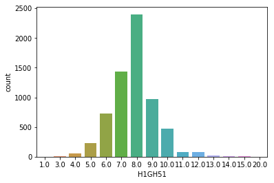
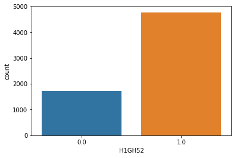
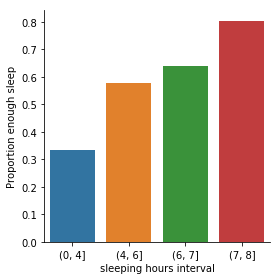

```python
import pandas as pd
import numpy
import seaborn
import matplotlib.pyplot as plt
from IPython.display import HTML, display
```


```python
df = pd.read_csv("~/Downloads/AddHealth Wave 1 Codebooks/addhealth_pds.csv",low_memory=False)
```


```python
pd.set_option('display.max_columns', None)
#Set PANDAS to show all rows in DataFrame
pd.set_option('display.max_rows', None)
```

### Section 3: General Health

Section 3 is about health and safety. In terms of illness, it focuses on symptoms rather than diagnoses.
Questions also touch on nutrition and weight control, use of health services, safety behaviors such as seatbelt use,
perceived risk, and sleep habits. The section is administered to all respondents.

* [H1GH51] Howmany hours of sleep do you usually get?
* [H1GH52] Do you usually get enough sleep? yes/no

Setting aside missing data


```python
df['H1GH51'] = df['H1GH51'].replace(96, pd.np.nan)
df['H1GH51'] = df['H1GH51'].replace(98, pd.np.nan)
```


```python
seaborn.countplot(x="H1GH51", data=df)
```


    <matplotlib.axes._subplots.AxesSubplot at 0x1a1965fcf8>





Setting aside missing data


```python
df['H1GH52'] = df['H1GH52'].replace(8, pd.np.nan)
df['H1GH52'] = df['H1GH52'].replace(6,pd.np.nan)
```


```python
seaborn.countplot(x="H1GH52", data=df)
```


    <matplotlib.axes._subplots.AxesSubplot at 0x1a18fc5048>





 Set format to numeric 


```python
df['age'] = pd.to_numeric(df['age'])
```

Sub group, who their ages between 14 t0 17


```python
age_group2 = df[( df['age'] >=14) & ( df['age'] <=17 )]
```

Setting aside missing data


```python
age_group2['H1GH51'] = age_group2['H1GH51'].replace(96, pd.np.nan)
age_group2['H1GH51'] = age_group2['H1GH51'].replace(98, pd.np.nan)
```

    /Users/ayman/anaconda3/lib/python3.6/site-packages/ipykernel_launcher.py:1: SettingWithCopyWarning: 
    A value is trying to be set on a copy of a slice from a DataFrame.
    Try using .loc[row_indexer,col_indexer] = value instead
    
    See the caveats in the documentation: http://pandas.pydata.org/pandas-docs/stable/indexing.html#indexing-view-versus-copy
      """Entry point for launching an IPython kernel.
    /Users/ayman/anaconda3/lib/python3.6/site-packages/ipykernel_launcher.py:2: SettingWithCopyWarning: 
    A value is trying to be set on a copy of a slice from a DataFrame.
    Try using .loc[row_indexer,col_indexer] = value instead
    
    See the caveats in the documentation: http://pandas.pydata.org/pandas-docs/stable/indexing.html#indexing-view-versus-copy
      


Subgroup who sleep less than 8.5 hours 


```python
g2_less_85 = age_group2[age_group2['H1GH51'] <8.5]
```


```python
g2_less_85.groupby('H1GH51').size()
```


    H1GH51
    1.0       1
    3.0       3
    4.0      14
    5.0      43
    6.0     212
    7.0     454
    8.0    1034
    dtype: int64


sleeping hours group 

* 0-4 
* 4-6
* 6-7
* 7-8


```python
g2_less_85['sleeping hours interval']= pd.cut(g2_less_85.H1GH51, [0, 4, 6,7, 8])
```

    /Users/ayman/anaconda3/lib/python3.6/site-packages/ipykernel_launcher.py:1: SettingWithCopyWarning: 
    A value is trying to be set on a copy of a slice from a DataFrame.
    Try using .loc[row_indexer,col_indexer] = value instead
    
    See the caveats in the documentation: http://pandas.pydata.org/pandas-docs/stable/indexing.html#indexing-view-versus-copy
      """Entry point for launching an IPython kernel.


Graph showing the association between your explanatory and response variables 


```python
seaborn.factorplot(x="sleeping hours interval", y="H1GH52", data=g2_less_85, kind="bar", ci=None)
plt.ylabel('Proportion enough sleep')
```


    Text(6.800000000000004, 0.5, 'Proportion enough sleep')




